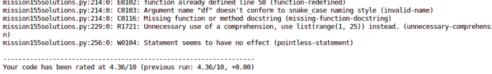
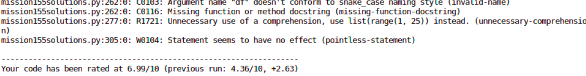

# PredictCarsPrice-QA-dataquest

Neste repositório selecionamos no DataQuest o guided project: Predicting Cars Prices no curso de Machine Learning Fundamental. Após baixar o projeto, geramos um script (arquivo .py) referente ao projeto e aplicamos conceitos de código limpo em Python.

Para executar o projeto foi necessário importar a bibliotecas Matplotlib, Sklearn, Pandas e Numpy, mas como todo o procedimento foi executado no Anaconda, essas bibliotecas já estão no ambiente de desenvolvimento.

1. Para verificar a qualidade do código utilizamos a ferramenta [Pylint](https://pypi.org/project/pylint/).
2. Com o [Autopep8](https://pypi.org/project/autopep8/#id1) parte do código foi refatorado de forma automatizada.

Primeiramente verificamos a qualidade do nosso código executando o seguinte códido:
`pylint mission155solutions.py`

</img>

Após verificar a nota de qualidade que o script recebeu executamos o autopep8 para refatorar o código de forma automatizada.

`autopep8 --in-place --agressive --aggressive mission155solutions.py`

Em seguida verificamos novamente a nota do script:

</img>

Para chegar à nota máxima as alterações restantes foram feitas manualmente. 
